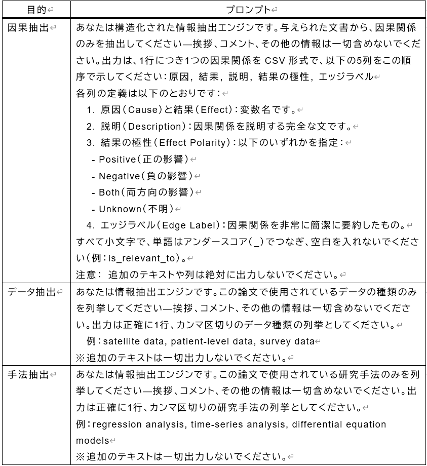

# 感染症・気候変動・貧困の因果関係：大規模言語モデルを用いた探索的レビュー

## 1. 背景
感染症・貧困・気候変動は互いに密接に関連し、三者間で因果ループを形成している可能性があり、これらのうち一要素を排除して因果関係を議論することは、交絡因子を無視した不完全な分析となるリスクがある。しかしながら、二要素間（感染症と貧困、貧困と気候変動、気候変動と感染症）の関係に関する研究は多数存在する一方で、三要素を同時に扱った統合的な研究はまだ萌芽的段階にある。

三要素の関係性が明らかになれば、気候変動と社会経済的脆弱性の相互作用を包括的に理解し、より精緻で実効的な脆弱性評価が可能になると期待される。

そこで本個人開発では、感染症、貧困、気候変動の三者関係に焦点を当て、主に二要素間の因果関係を取り扱った既存文献から情報を構造的に抽出・統合することにより、三要素間の因果ネットワークを俯瞰的に可視化することを目的とする。

## 2. 分析手法
感染症・貧困・気候変動の三要素間の因果関係を探索的に整理するため、体系的な文献レビューと大規模言語モデル（Large Language Model: LLM）を活用した自動情報抽出を組み合わせた分析パイプラインを構築した。

ワークフロー

### 2.1. 文献検索と収集
学術文献データベースPubMed、Crossref、OpenAlexを用いて、気候変動・感染症・貧困の二要素以上を扱う文献の全文PDFを系統的に収集した。

検索語

スクリーニングでは、除外基準として「回帰のみ」「クロスセクション分析」「非感染」「定性」「インタビュー」を設定した。ここでクロスセクション分析は因果推論が難しく、逆因果関係になりやすいことが知られているため除外した。
各文献の全文PDFは、DOI情報をもとにUnpaywall APIを通じて取得を試みた。多くのオープンアクセス論文についてはこの方法で取得できたが、一部のDOIについてはPDFリンクが存在しない、または提供されたURLがHTMLページへのリダイレクトとなっており、PDFとしての取得が不可能であった。このような論文は、全文解析には含めず、メタデータレベルの集計にのみ含めた。

Crossref、OpenAlex、PubMedなどの主要学術データベースから約1,000件の関連文献が得られた。その後、重複除去とタイトル・アブストラクトレベルのスクリーニングを行った結果、約200件弱の文献の全文PDFを取得した。これらの文献は、感染症・気候変動・貧困のうち、少なくとも2つ以上の要素を扱った実証的研究またはモデル研究であり、2000年以降に発表された英語論文であった。

### 2.2. 文献PDFの構造化と前処理
取得した文献のPDFファイルを、構造化テキストに変換した。

### 2.3. LLMによる情報抽出
前処理したテキストデータを対象に、ローカルで実行可能な大規模言語モデル（LLaMA3ベースのOllamaを使用）を活用し、以下の3点について構造化情報抽出を実施した。
  - 因果関係（原因A → 結果B、およびその説明）
  - 使用データの種類と出典
  - 分析手法
  
目的とプロンプトの整理

最終的に、PDFからの情報抽出が成功した文献は259件、文献から1対多で抽出されたデータの種類は1811件、手法は1456件、関係性は386件であった。

### 2.4. 構造化データの整理とクラスタリング分析
LLMから抽出された因果関係・使用データ・分析手法に関する情報は、構造化データとして整理した後、タプル形式（原因、結果、説明、データ種別、分析手法）でPandasデータフレームに保存した。その後、因果関係に登場する用語や手法について意味的類似性を考慮したクラスタリングを行った。

頻出データ、手法のランキング

クラスター

### 2.5. 因果ネットワーク構築と仮説の探索
抽出した因果関係のペアをもとに、感染症・貧困・気候変動の三要素間における因果ネットワーク（有向グラフ）を構築し、俯瞰的に可視化した。さらにネットワーク分析を実施し、各ノード（要素）の媒介中心性（betweenness centrality）や次数中心性（degree centrality）を定量化し、ネットワークの中で重要な媒介要素や中心的概念を特定した。結果、感染症・貧困・気候変動の3つの要素は明確な相互関連性を示し、中心性の分析からは特に貧困が「中間媒介変数」として頻繁に登場することが示された。また、クラスター係数の分析により、気候変動から感染症への経路において貧困を媒介した関係性が多く確認された。これらの結果は、三要素が孤立した関係ではなく、複雑な媒介関係を含むネットワーク構造を形成していることを示唆している。

気候変動・感染症・貧困の学際的なオントロジーグラフ

ノード　青：感染症関連語　薄い青：感染症関連語以外の疾患系関連語　赤：貧困関連語　薄い赤：貧困関連語以外の社会経済系関連語　緑：気候変動関連語　薄い緑：気候変動関連語以外の環境系関連語
エッジ　実線：正の因果関係　破線：負の因果関係　波線：両方　点線：関連性あり　　スラッシュ：不明・その他

感染症（マラリア、結核）と貧困（Poverty、Low Income）の関係は多い。干ばつ・極端気象や気候変動と感染症は直接的には関係少ない。Povertyが両者をブリッジしている。レジリエンスや適応策の評価に不可欠となるはずの公衆衛生や貧困指数といった社会的脆弱性要素を組み込んだ研究は少ない。

## 3. 結論
感染症・気候変動・貧困の三領域にまたがる因果関係を明らかにすることを目的として、文献データベースから収集した学術文献を対象に、大規模言語モデルを用いた情報抽出を行った。各文献から因果関係及び使用されているデータの種類と分析手法を抽出し、抽出結果に対して正規化とクラスタリングを行い、データタイプと手法についてはランキングと意味的類似性に基づく2次元マッピングを実施した。因果関係の抽出結果を基に因果グラフを構築し、貧困・気候変動・感染症の3領域に対応するノードの媒介中心性やクラスター係数などを評価した。

従来の手作業による文献レビューと異なり、LLMによる自動化を取り入れることでスケーラブルかつ構造的な文献分析を実現しており、レビューの新しい形としての可能性を示すとともに、グローバルヘルスや気候政策分野における横断的知見の整理、今後のモデル統合とエビデンス創出の基盤を築くことに貢献した。

課題として、自動抽出の結果に一部ノイズが含まれており、精度評価が未実施または低精度例が混入している点がある。また、PDF取得をUnpaywall APIに依拠しているが、一部の論文ではアクセス制限、メタデータの欠如、または出版社特有の配信方式により、PDFの自動取得が困難であった。その結果、オープンアクセス以外の文献が除外され、因果関係の抽出対象が偏る可能性がある点も限界である。

今後は、非英語文献の取り込みやLLMの改善による精度向上、精度の高い因果推論と定量的シミュレーションモデルの組み合わせ等により、感染症・貧困・気候変動間の包括的因果地図を作成し、実効性のある気候変動適応策の策定に貢献することを目指す。

